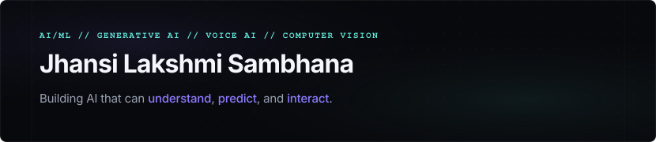

<div align="center">
  
</div>

<br />

<div align="center">
  <a href="https://jhansi48.github.io/Portfolio/"></a>
  <a href="https://www.linkedin.com/in/jhansi-lakshmi-sambhana-64ba35393/"></a>
  <a href="https://github.com/jhansi48"></a>
  <a href="https://leetcode.com/u/jhansi_lakshmi_sambhana/"></a>
  <a href="mailto:jhansilakshmisambhana12@gmail.com"></a>
</div>

---

### ✦ About Me

I am a **B.Tech Computer Science & Engineering (AI & ML)** student at Anil Neerukonda Institute of Technology and Sciences (ANITS), Visakhapatnam. I am passionate about building practical intelligent systems across Machine Learning, Generative AI, Voice AI, Computer Vision, and autonomous AI Agents.

---

### ✦ Core Focus Areas

| **🧠 Machine Learning** | **✨ Generative AI** |
| :--- | :--- |
| Predictive Analytics · Time Series Forecasting · XGBoost · Random Forest · AutoML | LLMs · Function Calling · AI Agents · Multi-Agent Systems |
| **🎙️ Voice AI** | **👁️ Computer Vision** |
| ASR · TTS · Conversational AI · Multilingual Voice Applications | OpenCV · MediaPipe · Real-Time Vision Applications |

---

### ✦ Featured Projects

#### 01 ✦ ExpenseMate — Multilingual Voice-First Financial Assistant
> **Primary Showcase:** A real-time conversational voice agent enabling users to record expenses and query financial summaries through natural, multilingual voice interactions.

* **Voice-First Interaction:** Real-time bi-directional conversation with automatic speech recognition (ASR) and text-to-speech (TTS).
* **Cognitive Agent Engine:** Powered by Google Gemini LLM with custom tool/function calling for structured expense tracking.
* **Code-Mixed Multilingual NLP:** Seamless multilingual interaction across English, Hindi, Telugu, and mixed phrasing.
* **Enterprise Infrastructure:** Integrated multi-agent workflows, SIP outbound connectivity, and detailed call analytics.
* **Stack:** `LiveKit` · `Google Gemini` · `ASR/TTS` · `Murf Falcon TTS` · `Multilingual NLP` · `Multi-Agent Systems`
* 🔗 **[GitHub Repository](https://github.com/Jhansi48/murf-livekit-starter)** &nbsp;|&nbsp; 📖 **[Technical Deep Dive](https://dev.to/jhansi_lakshmisambhana/from-make-it-talk-to-make-it-think-my-10-day-voice-ai-journey-3280)**

#### 02 ✦ Vendor IQ — Procurement Risk & Reliability Intelligence
> Full-stack dashboard developed as part of Infosys Springboard Virtual Internship 7.0 for vendor scoring, reliability tracking, and risk analytics.

* **Capabilities:** Integrated vendor risk evaluation, workflow automation, and interactive data dashboards.
* **Backend & Security:** Built with FastAPI, PostgreSQL, SQLAlchemy, and secure JWT authentication.
* **Stack:** `FastAPI` · `Angular` · `TypeScript` · `PostgreSQL` · `SQLAlchemy` · `JWT`
* 🔗 **[GitHub Repository](https://github.com/Jhansi48/Infosys-Project)** &nbsp;|&nbsp; 🖥️ **[Live Demo](https://vendoriq-rho.vercel.app/)**

#### 03 ✦ Telegram Voice Expense Tracker
> An automated bot that parses voice messages containing expense details into structured database entries.

* **Core Pipeline:** OpenAI Whisper API for voice transcription and custom Regex parsing for automatic categorization.
* **Stack:** `Python` · `OpenAI Whisper` · `Telegram Bot API` · `Pandas` · `OpenPyXL` · `Regex`
* 🔗 **[GitHub Repository](https://github.com/Jhansi48/expense-telegram-bot)**

#### 04 ✦ Gesture-Controlled Subway Surfers
> A real-time gesture-control pipeline for desktop arcade gameplay using computer vision.

* **Core Pipeline:** Hand gesture tracking via MediaPipe, frame processing via OpenCV, and automated keyboard mapping via PyAutoGUI.
* **Stack:** `Python` · `OpenCV` · `MediaPipe` · `PyAutoGUI`
* 🔗 **[GitHub Repository](https://github.com/Jhansi48/AI-Gesture-SubwaySurfers)**

---

### ✦ Professional Experience

* **Machine Learning Intern** at **Future Interns** `Aug 2026 — Present`
  * Developing practical ML classification and forecasting workflows.
* **Software Development Intern** at **Infosys Springboard 7.0** `Jul 2026 — Present`
  * Building and deploying full-stack procurement platform (FastAPI, Angular, PostgreSQL).
* **Machine Learning Engineer Intern** at **MSME 360** `Jun 2026 — Present`
  * Creating time-series forecasting models using XGBoost, Random Forest, and AutoGluon.
* **Software Development Trainee** at **Infosys Pragathi Cohort 7** `Dec 2025 — Feb 2026`
  * Specialized training in software engineering, database management systems, and Agile.
* **Artificial Intelligence Intern** at **SkillForge** `May 2025 — Jul 2025`
  * Built and evaluated ANN and CNN neural network models in Python.

---

### ✦ Education

🎓 **B.Tech in Computer Science & Engineering (AI & ML)** `2023 — 2027`
**Anil Neerukonda Institute of Technology and Sciences**, Visakhapatnam
* **Cumulative GPA:** `9.19 / 10`

---

### ✦ Technical Stack

* **AI / ML:**       
* **GenAI / Voice:**    
* **Computer Vision:**  
* **Development:**     
* **Databases:**    
* **Languages:**   

---

### ✦ Currently Exploring

```text
Machine Learning ➔ Deep Learning ➔ Generative AI ➔ AI Agents ➔ RAG ➔ Multimodal AI ➔ MLOps
```

---

### ✦ Achievements & Credentials

* 🏅 **Amazon ML Summer School 2026** — Shortlisted candidate.
* 💻 **130+ LeetCode Problems** — Solved ([LeetCode Profile](https://leetcode.com/u/jhansi_lakshmi_sambhana/)).
* 🧠 **Infosys Pragathi** — Cohort 7 Software Development Graduate.
* 📜 **Industry Certifications** — AWS Cloud Practitioner Essentials, Cisco Network Defense, Cisco Network Addressing, and Infosys OOP (Python).
* 🏅 **Digital Credentials** — Badge transcript verified on [Credly Profile](https://www.credly.com/users/jhansi-lakshmi-sambhana).

---

### ✦ GitHub Activity

<div align="center">
  
  
</div>

<br />

<div align="center">
  <h3><i>Build. Learn. Experiment. Create Impact.</i></h3>
  <p><strong>Let's build something intelligent.</strong></p>
  <p>
    <a href="https://jhansi48.github.io/Portfolio/">Portfolio</a> &bull;
    <a href="https://www.linkedin.com/in/jhansi-lakshmi-sambhana-64ba35393/">LinkedIn</a> &bull;
    <a href="https://github.com/jhansi48">GitHub</a>
  </p>
</div>
